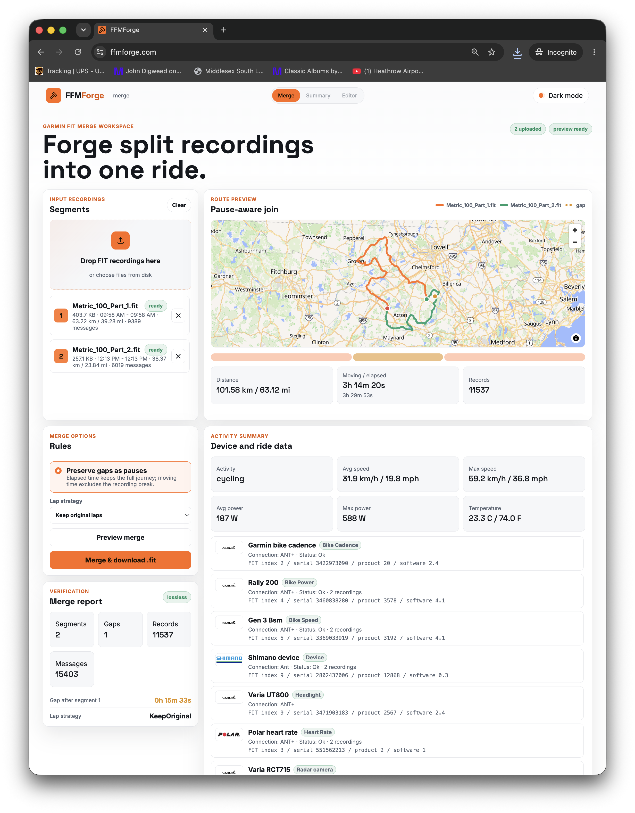
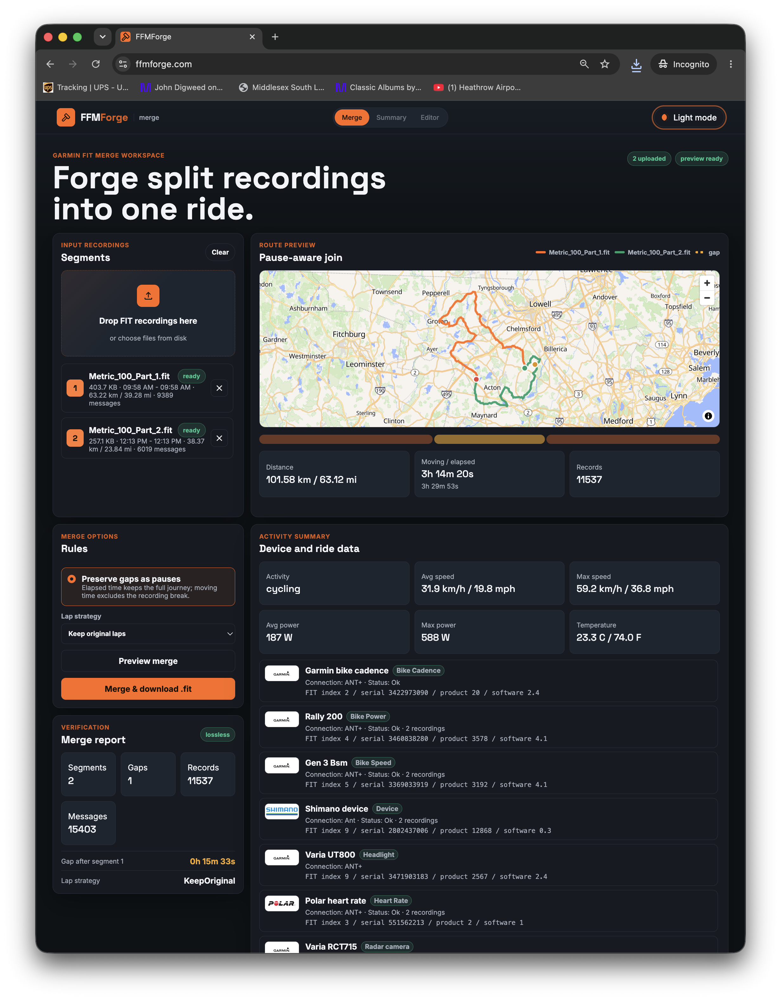
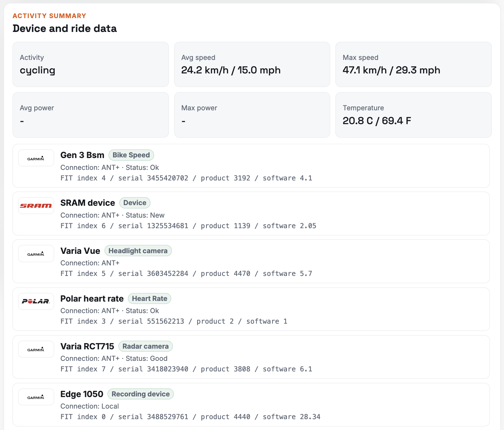

# FFMForge

FFMForge is a Garmin FIT merge workspace for joining split ride recordings back
into one valid `.fit` activity.

The common case is a long ride captured as multiple recordings because of a
device restart, battery swap, or recording break. FFMForge uploads those FIT
files, previews the routes and ride/device metadata, preserves gaps as pauses,
and produces one merged FIT file.

Production URL: [https://ffmforge.com](https://ffmforge.com)

<table>
  <tr>
    <td width="33%"></td>
    <td width="33%"></td>
    <td width="33%"></td>
  </tr>
</table>

---

## Current State

This branch contains a working first public version:

- Angular 22 frontend hosted from private S3 through CloudFront.
- Lambda/API Gateway backend at `/ffmforge/v1/*`.
- Private S3 data bucket for uploaded FIT files and generated merge results.
- OpenTofu infrastructure for S3, CloudFront, ACM, Route53, API Gateway,
  Lambda, IAM, lifecycle, and cleanup scheduling.
- Scala 3 FIT codec/merge core using the official Garmin FIT Java SDK.

FIT files are temporary working data. The app enforces a short application TTL,
and S3 lifecycle is a one-day backstop.

---

## What Works

- Decode and encode real Garmin FIT files through `GarminFitCodec`.
- Preserve unknown FIT messages and fields through the lossless `FitMessage`
  store.
- Upload one or more FIT files from the browser using presigned S3 URLs.
- Describe uploaded FIT files: ride stats, devices, file layout, and tracks.
- Render uploaded routes with MapLibre GL JS 5 and OpenFreeMap vector tiles.
- Dry-run merge to inspect gaps, records, and output layout.
- Merge and download a generated `.fit`.
- Group duplicate device rows in the UI while keeping raw API data lossless.
- Run local codec/merge demos against sample or real FIT files.
- Run deployed Lambda codec smoke checks against the public API.

---

## Architecture

The repo is a single Gradle project with three main parts:

| Area | Path | Purpose |
| --- | --- | --- |
| FIT core | `source/scala/ffmforge/fit/` | Codec facade, model, summaries, merge engine |
| Lambda/API | `source/scala/ffmforge/lambda/`, `source/scala/ffmforge/http/`, `source/scala/ffmforge/store/` | API routing, JSON DTOs, S3-backed storage |
| Frontend | `frontend/` | Angular workspace UI |
| Infrastructure | `infra/` | OpenTofu AWS stack |

Runtime shape:

```text
Browser
  -> CloudFront
    -> S3 frontend origin
    -> API Gateway /ffmforge/v1/*
      -> Lambda container image
        -> private S3 data bucket
```

The backend is packaged as a Lambda container image. ECR is treated as an
existing repository and is looked up by OpenTofu; OpenTofu does not create or
manage ECR.

---

## Requirements

- JDK 21 available to Gradle. The build uses a Gradle Java toolchain targeting
  `-release 21`.
- Node 24.15.x for frontend work. Node 26.3.1 currently triggers an
  Angular/esbuild deadlock during `ng build`, even though Angular's published
  engine range allows Node 26.
- Docker for backend image builds.
- OpenTofu for infrastructure.
- AWS CLI authenticated locally with the intended profile.
- No global Gradle required; use `./gradlew`.

---

## JDK 21 Setup

Install a JDK 21, then confirm Gradle can see it:

```bash
./gradlew -q javaToolchains
```

If a Homebrew or SDKMAN JDK is not auto-detected, add the path to
`~/.gradle/gradle.properties`:

```properties
org.gradle.java.installations.paths=/opt/homebrew/opt/openjdk@21/libexec/openjdk.jdk/Contents/Home
```

Gradle can launch on JDK 17+, but compile/test/run tasks use the JDK 21
toolchain.

---

## Build And Test

```bash
./gradlew check
```

`check` compiles Scala, runs Scalafix, checks formatting, and runs unit tests.
To apply formatting/fixable Scalafix changes:

```bash
./gradlew scalafix spotlessApply
```

Frontend checks:

```bash
cd frontend
npx tsc -p tsconfig.app.json --noEmit
./node_modules/.bin/ngc -p tsconfig.app.json
```

Angular production build with Node 24:

```bash
cd frontend
npx -p node@24.15.0 node ./node_modules/@angular/cli/bin/ng build --progress=false
```

Gradle frontend tasks also exist, but they require `node` on `PATH` to be a
supported Node 22/24 runtime:

```bash
./gradlew frontendInstall
./gradlew frontendBuild
./gradlew frontendServe
```

---

## Local Frontend

Start the Angular dev server:

```bash
cd frontend
npx -p node@24.15.0 node ./node_modules/@angular/cli/bin/ng serve \
  --host 127.0.0.1 \
  --proxy-config proxy.conf.json \
  --port 4200
```

Open [http://127.0.0.1:4200](http://127.0.0.1:4200).

The proxy forwards `/ffmforge/v1/*` to the deployed API. Local browser uploads
need the data bucket CORS configuration to include the local dev origins. Keep
that in ignored local OpenTofu config, not in committed files.

---

## Deployment

Sensitive deployment values live in ignored local OpenTofu files such as
`infra/local.auto.tfvars`. Do not commit local DNS IDs, account values, image
URIs, or other environment-specific settings.

Initialize and inspect infrastructure:

```bash
./gradlew tofuInit
./gradlew tofuValidate
./gradlew tofuPlan
```

Apply infrastructure:

```bash
./gradlew deployInfra
```

Refresh backend image and Lambda/API infrastructure:

```bash
./gradlew refreshBackend
```

Publish the already-built Angular artifact:

```bash
./gradlew refreshFrontend \
  -PffmForgeFrontendDir="$PWD/frontend/dist/ffm-forge-ui/browser" \
  --console=plain
```

`refreshFrontend` syncs the static frontend artifact to S3 and invalidates
CloudFront. If `-PffmForgeFrontendDir` is omitted, Gradle attempts to run
`frontendBuild` first, which requires a supported Node runtime on `PATH`.

Full deployment:

```bash
./gradlew deploy
```

Undeploy the serving/runtime stack while preserving S3 bucket resources:

```bash
./gradlew undeploy -PconfirmUndeploy=true
```

OpenTofu bucket resources are protected with `prevent_destroy`. The Gradle
undeploy path may empty bucket contents when explicitly confirmed, but it does
not destroy the S3 bucket resources.

---

## API Overview

Public API prefix:

```text
/ffmforge/v1/
```

Implemented routes include:

- `POST /uploads` - create presigned upload URLs.
- `POST /fit/describe` - summarize uploaded FIT files.
- `GET /fit/{id}/track` - return GeoJSON route data.
- `POST /fit/merge` - dry-run or execute a FIT merge.
- `GET /fit/{id}/download` - create a presigned download URL.
- `POST /fit/codec-demo` - deployed Lambda codec round-trip demo.

---

## Runnable Demos

Codec demo:

```bash
./gradlew codecDemo
./gradlew codecDemo --args="samples/your_ride.fit"
```

With a real file, this decodes the activity, prints devices and ride summary,
re-encodes, re-decodes, and verifies the round trip. The re-encoded file is
written next to the input as `*.roundtrip.fit`.

Merge demo:

```bash
./gradlew mergeDemo
./gradlew mergeDemo --args="samples/your_ride.fit"
```

With a real file, this splits the ride into two recordings, drops a middle slice
to simulate a recording gap, rejoins the pieces, and writes `*.merged.fit`.

Deployed Lambda codec demo:

```bash
./gradlew lambdaCodecDemo \
  -PffmForgeBaseUrl=https://ffmforge.com \
  --args="samples/your_ride.fit"
```

This requests a presigned upload URL from the public API, uploads the local FIT
file to private S3, then asks Lambda to decode, encode, decode, summarize, and
verify it.

Sample FIT files can be placed under `samples/`. Keep private or personal ride
files out of commits unless they are intentionally scrubbed/test-safe.

---

## Notes

- Frontend map rendering uses MapLibre GL JS 5.24.0 loaded at runtime and the
  OpenFreeMap Liberty style at `https://tiles.openfreemap.org/styles/liberty`.
- Angular asset versioning is handled by hashed bundle filenames.
- A future SPA version check can poll `version.json` and prompt users to refresh
  when a new frontend is available.
- FIT processing uses Garmin's official Java SDK behind the FFMForge codec
  facade.

---

## License

See [LICENSE](LICENSE).

The Garmin FIT SDK is distributed under the Garmin FIT Protocol License
(proprietary, free to use).
