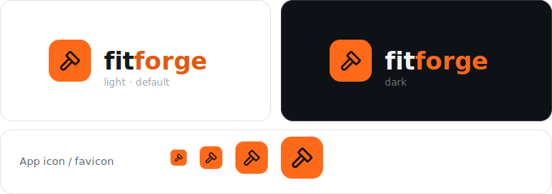
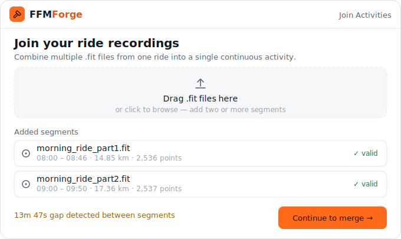
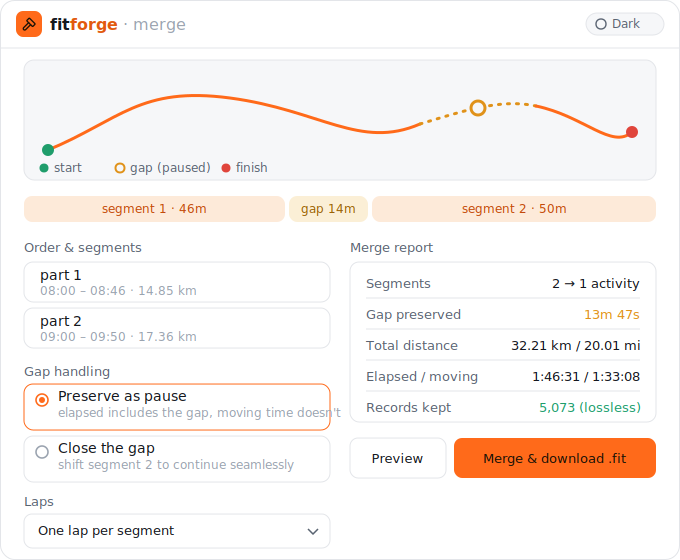
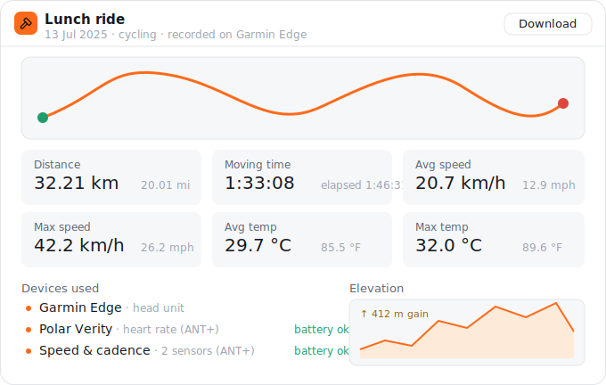
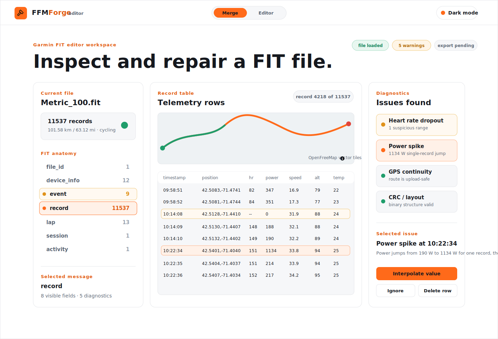
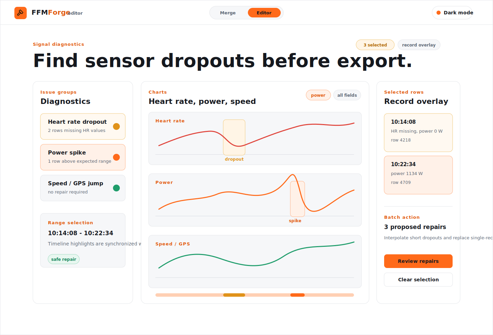
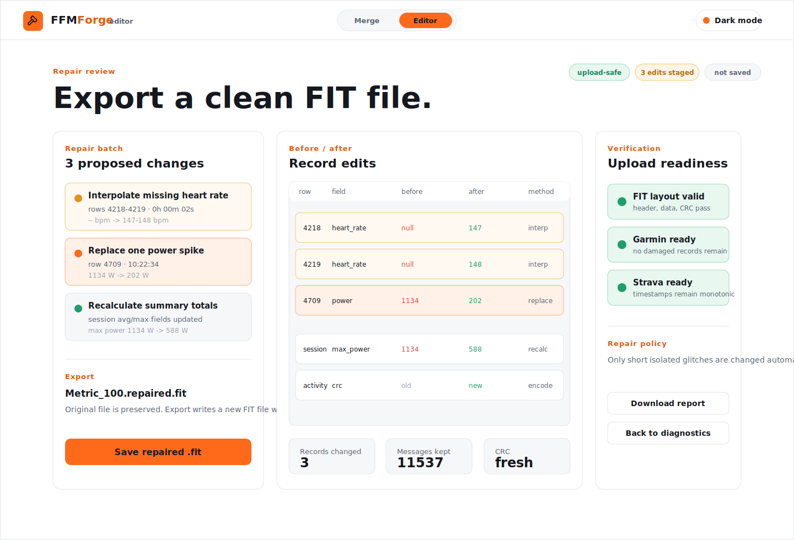

# FFMForge — UI design spec

> 🚧 Design reference for the (not-yet-built) frontend. It captures the **Forge**
> visual language, the component inventory, and the core screens so the Angular
> build has a single source of truth. Mockups below are committed as SVG in
> [`docs/mockups/`](mockups/). Fully interactive HTML versions were prototyped
> separately; this doc is the durable record.

---

## Brand

- **Mark:** a hammer in a rounded square (Tabler `ti-hammer`, dark `#1A1206` on
  forge orange). **Wordmark:** "FFM" + "Forge", where **Forge** takes the accent
  colour. Tagline: *forge every ride into one*.
- **Favicon / app icon:** the hammer tile alone — a single glyph that stays
  legible down to 20px.

### Typography
- **Space Grotesk** (700 / 500) — wordmark, headings, and all **numbers/data**
  (distances, times, power). Numbers should feel engineered.
- **Inter** (400 / 500) — body copy, labels, and controls.
- Two weights only (400, 500; 700 reserved for the wordmark/display). Sentence
  case everywhere.

### Theming — light default, dark toggle
Light/white mode is the **default**; dark is a toggle. Implement as a
`[data-theme="light|dark"]` attribute on the root that swaps a single set of
SCSS custom properties — one palette, only the values change. `#FF6A1A` stays
constant across both modes (logo tile + primary buttons).

| Token | Role | Light | Dark |
|---|---|---|---|
| `--ff-orange` | primary fill, logo, route | `#FF6A1A` | `#FF6A1A` |
| `--ff-accent` | wordmark "forge", links | `#E1590F` | `#FF6A1A` |
| `--ff-bg` | page | `#FFFFFF` | `#0E1216` |
| `--ff-card` | card surface | `#FFFFFF` | `#161B22` |
| `--ff-raised` | inset / metric surface | `#F6F7F9` | `#1E2530` |
| `--ff-border` | hairline border | `#E3E5E9` | `#2A323D` |
| `--ff-text` | primary text | `#15181E` | `#F2F4F7` |
| `--ff-text-2` | secondary text | `#5A6472` | `#A7B0BC` |
| `--ff-text-3` | tertiary / hints | `#9AA3AF` | `#6B7480` |
| `--ff-active` | active / valid / lossless | `#1F9D6B` | `#34D399` |
| `--ff-gap` | recording gap / pause | `#E0921A` | `#F5A623` |
| `--ff-finish` | finish marker | `#E0453C` | `#F2554D` |

**Status colour meanings (keep consistent):** orange = route & primary action,
gold = gap/pause, green = active/valid/lossless, red = finish.

---

## Design tokens

- **Radius:** 8px controls, 9–10px inset panels, 12–14px cards/app frame, pill
  (`999px`) for toggles/chips.
- **Border:** 1px `--ff-border` hairlines.
- **Spacing:** 16px frame padding; 8–14px gaps between components.
- **Buttons:** primary = solid `--ff-orange` with `#1A1206` text; secondary =
  transparent with `--ff-border` and `--ff-text`.
- **Numbers:** always rendered metric **and** imperial where applicable
  (`32.21 km / 20.01 mi`, `20.7 km/h / 12.9 mph`, `29.7 °C / 85.5 °F`); time has
  no imperial form. Backend stays SI — the UI formats units (a user preference
  later).

---

## Component inventory

- **Top bar** — logo lockup (+ context label e.g. `· merge` / `· editor`),
  two-tab nav (`Merge`, `Editor`), theme toggle. `Summary` is intentionally
  removed; summary data lives inside the active workspace.
- **Drop zone** — dashed inset panel with upload glyph; accepts multiple `.fit`.
- **Segment row** — file/gps icon, filename, time-range · distance · point count,
  validity badge, remove/drag affordances.
- **Status chips** — `valid` (green), `13m 47s gap` (gold), `lossless` (orange);
  tinted background + same-family text.
- **Route panel** — map/route preview: orange active path, gold dashed gap, green
  start dot, red finish dot, hollow gold ring at the gap. (Real app: MapLibre GL
  vector tiles; this is the brand styling layered on top.)
- **Segment timeline** — proportional bar: segment (orange tint) · gap (gold
  tint) · segment, widths scaled to duration.
- **Option cards (radio)** — selected card outlined in orange; title + helper.
- **Merge report** — labelled key/value rows; gap in gold, lossless count in
  green; mirrors the backend's `MergeReport`.
- **Metric card** — `--ff-raised` surface, 12px label, 20px/500 value, 12px
  sub-unit. Used in 2–3 col grids.
- **Device row** — bullet, device name, sensor kind/connection, battery status.
- **FIT anatomy tree** — message groups with counts and status markers; selected
  message controls the table view.
- **Record table** — dense but readable telemetry table with timestamp, position,
  heart rate, power, speed, cadence, altitude, and temperature columns.
- **Diagnostic issue card** — grouped warning cards for sensor dropouts, GPS
  anomalies, invalid timestamps, and damaged records.
- **Repair review row** — before/after value display with repair method and final
  export readiness status.

---

## Screens

### 1 · Upload

Entry point. Drag in two or more `.fit` segments; each is validated on the spot
and the recording gap between them is surfaced immediately. Primary action
advances to the merge workspace.

**Elements:** top bar · heading + subtitle · multi-file drop zone · added-segment
rows (with validity) · gap notice · primary `Continue to merge` button.

### 2 · Merge workspace (core screen)

Where the join happens. The combined route shows the gap as a pause; a
duration-proportional timeline and a reorderable segment list sit alongside the
**gap-handling** choice (preserve-as-pause vs close) and lap strategy. A live
**merge report** mirrors the backend output — including the lossless record count
— before the user commits with `Merge & download .fit`.

**Elements:** route panel + legend · segment/gap timeline · ordered segment list ·
gap-handling radios · lap strategy select · merge report · preview + primary CTA ·
theme toggle.

### 3 · Activity summary

Post-merge (or single-file) overview: route, headline stats in metric + imperial,
the devices used (sensor kind, connection, battery), and an elevation profile.

**Elements:** title + sport + primary device · download · route panel · metric
card grid (distance, moving/elapsed, avg/max speed, avg/max temp; power when a
meter is present) · devices list · elevation chart.

### 4 · FIT editor

| Overview | Signal diagnostics | Repair review |
|---|---|---|
|  |  |  |

Single-file inspection and repair workspace. The editor is a FIT repair bench,
not a copy of the dense desktop FIT viewers: the user can understand file
anatomy, diagnose telemetry glitches, stage repairs, and export a clean `.fit`
without losing the FFMForge visual language.

**Overview elements:** loaded file card · FIT anatomy tree · selected message
metadata · route preview strip · telemetry record table · issue summary · repair
actions.

**Diagnostics elements:** issue groups for heart rate, power, speed/GPS,
timestamps, and damaged records · synchronized field charts · highlighted
timeline ranges · selected record overlay.

**Repair review elements:** proposed repair batch · before/after record values ·
summary recalculation · fresh CRC verification · Garmin/Strava readiness ·
primary `Save repaired .fit` action.

---

## Implementation notes (for the Angular build)

- **Angular 22** standalone components; theme via `[data-theme]` + SCSS custom
  properties matching the token table above.
- **Fonts:** Space Grotesk + Inter (self-hosted or Google Fonts).
- **Icons:** Tabler outline set.
- **Map:** MapLibre GL (vector tiles), brand-styled route/markers.
- **Data contract:** screens map directly onto existing backend types —
  `MergeReport`/`MergeOutcome` (merge workspace), `FitSummary` /`RideSummary` +
  `DeviceInfo` (activity summary), `FitLayout` (file layout). Units formatted
  client-side from SI values.
- **Editor contract, intended:** editor data should expose file anatomy
  (`FitLayout` plus message counts), selected message rows, diagnostic issue
  groups, staged repair operations, and an export verification result.
- **Not yet specified here:** activities library, empty/error states for the
  editor, and mobile/responsive editor layouts — to be added before those
  screens are built.
